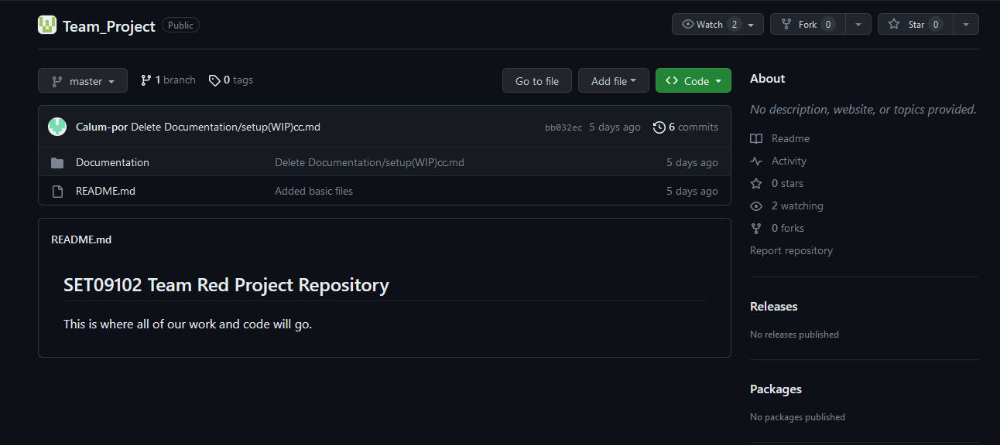
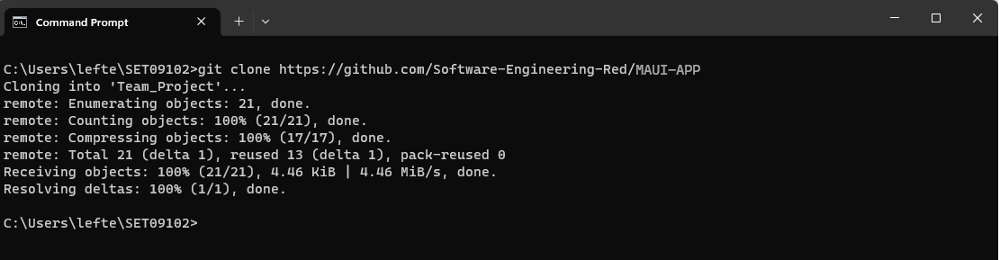
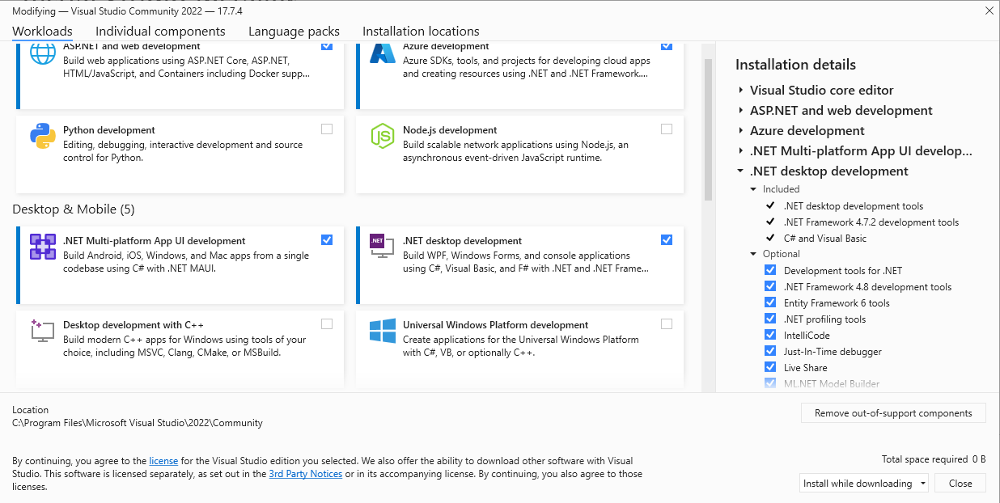

# Setup

This section documents your practical work in week 2.

The main requirements are to show that:

1. Your development environment is correctly set up
2. You understand the setup including potential alternative configuration settings

## Environment configuration

During the second week, my primary objective was to establish and configure my development environment in order to meet the collaborative demands of the course. This study encompassed a number of essential tasks, which have been thoroughly documented in the following section.

#### Task 1. Create a team repository for the Red Team
 
- **Screenshot:** 
  <figcaption align = "center"><b>Figure 1 Shared GitHub repository</b></figcaption> 
  - **Figure 1:** shows our team's repository. This image depicts the main page of the shared GitHub repository for our team. It was very important to collaborate effectively since the very beginning of our project, as minor mistakes might cause serious issues at later stages of the team project. This repository will contain all of the project files (including documentation), and stores each file's revision history centralized(like a central server between all team members).

#### Task 2. Clone the team repository into local
- **Screenshot:** 
  <figcaption align = "center"><b>Figure 2 Cloning the team repository</b></figcaption> 
  - **Figure 2:** This image shows how to clone the repository using the Git CLI using Windows 11. I already had git installed on my PC, but if you don't just download it from here: https://git-scm.com/downloads and follow the setup process. After the setup is done, restart your CMD/Powershell and you will have it working.
#### Task 3. Install all dependencies in Visual Studio
- **Screenshot:** 
  <figcaption align = "center"><b>Figure 3 Checking and Installing prerequisites using the "Visual Studio Installer" </b></figcaption> 
- **Comment:** Shows the Visual Studio Installer modifying window that shows us that I already have the MAUI package installed. If you don't have it you can tick the checkbock and click "install" and it will easy and conveniently install it for you.

  
**DO**

* Place your image files in the `images` folder
* Choose your screenshots carefully so that they communicate the appropriate information.
  Many screenshots with no clear purpose or with trivial differences are of little value.
* Provide <ins>descriptive</ins> commentary to explain why the screenshot is included. 
  what it shows and point out any particularly significant details.
* Modify your screenshots - for example, by adding arrows, outlines or other highlighting 
  techniques - to enhance their communication value.
* Remove unnecessary material from your screenshots such as toolbars, other windows and 
  computer desktop to eliminate distractions.
* Ensure that any important content is clearly legible. Pay particular attention to text
  size and image resolution.
* Use [numbered captions](https://towardsdev.com/3-ways-to-add-a-caption-to-an-image-using-markdown-f2ca30562be6) 
  as labels for images. Also, use the caption numbers to refer to images in your text.

**DON'T**

* Expect the reader to understand your reasons for including a screenshot. If you can't
  explain it, the screenshot will not do the job on its own.
* Include self-evident comments. For example, don't simply list the values used on a
  configuration page if those values are clearly visible in the screenshot.

## Reflection

For this section, decide what points are worth making and structure your content 
appropriately.

**DO**

* Use sub-headings to differentiate between sections
* Provide <ins>reflective</ins> commentary that discusses, for example, limitations of
  your current configuration, how your configuration is appropriate for the current 
  project, alternative configuration that might be appropriate in ther circumstances, 
  etc.
* Mention any difficulties you had setting up your working environment and how you 
  resolved them

**DON'T**

* Repeat the descriptive commentary from point 1
* Give a blow-by-blow account of everything you did. Instead, you should highlight 
  the important points.
