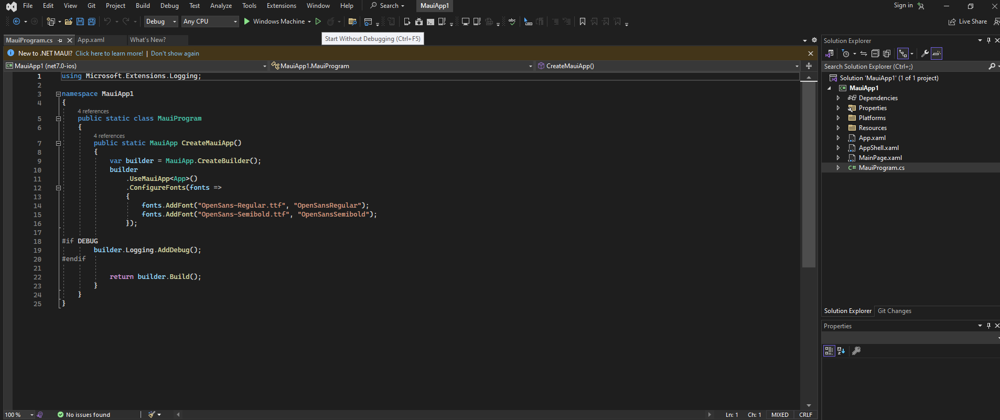
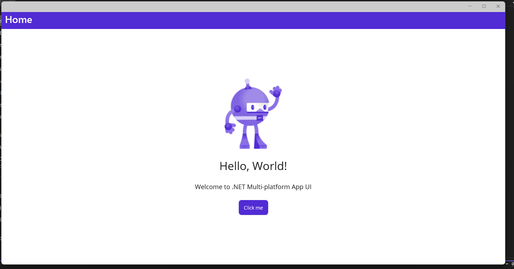

# Setup

This section documents your practical work in week 2.

The main requirements are to show that:

1. Your development environment is correctly set up
2. You understand the setup including potential alternative configuration settings

## Environment configuration

During the second week, my primary objective was to establish and configure my development environment in order to meet the collaborative demands of the course. This study encompassed a number of essential tasks, which have been thoroughly documented in the following section.

#### Task 1. Create a team repository for the Red Team
 
- **Screenshot:** 
  <figcaption align = "center"><b>Figure 1 Shared GitHub repository</b></figcaption> 
 - **Comment:**  shows our team's repository. This image depicts the main page of the shared GitHub repository for our team. It was very important to collaborate effectively since the very beginning of our project, as minor mistakes might cause serious issues at later stages of the team project. This repository will contain all of the project files (including documentation), and stores each file's revision history centralized(like a central server between all team members).

#### Task 2. Clone the team repository into local
- **Screenshot:** 
  <figcaption align = "center"><b>Figure 2 Cloning the team repository</b></figcaption> 
- **Comment:**  This image shows how to clone the repository using the Git CLI using Windows 11. I already had git installed on my PC, but if you don't just download it from here: https://git-scm.com/downloads and follow the setup process. After the setup is done, restart your CMD/Powershell and you will have it working.
#### Task 3. Install all dependencies in Visual Studio
- **Screenshot:** 
  <figcaption align = "center"><b>Figure 3 Checking and Installing prerequisites using the "Visual Studio Installer" </b></figcaption> 
 - **Comment:** Shows the Visual Studio Installer modifying window that shows us that I already have the MAUI package installed. If your window doesn't have that same box ticked, you most likely don't have it. In order to install it as easy as possible you can tick the checkbock and then click "install" at the bottom-right corner and it will easy and conveniently install it for you.
#### Task 4. Open the MAUI App using Visual Studio
- **Screenshot:** 
  <figcaption align = "center"><b>Figure 4 Opened the MAUI App</b></figcaption> 
- **Comment:** This image shows the opened MAUI App just before running it. The screenshot is included in case the user is new to VS and depicts how an opened project looks and the button that needs to be clicked in order to build the program.
#### Task 5. Run the MAUI App
- **Screenshot:** 
  <figcaption align = "center"><b>Figure 5 The MAUI App up-n-running </b></figcaption> 
- **Comment:** The screenshot shows the running MAUI App and its beatiful robot. When the button on the windows gets clicked, it rerenders and starts a click counter.

## Reflection
### Repository setup

The portfolio setup was pretty straightforward and I did it within a few minutes.

### Teamwork

The teamwork is very important and in the beginning it was a bit tough to get into communication with each other, but once a person from our team decided it was a good idea to get a Discord server and once we had one running it was much easier. We could have used different platforms such as Teams, but I'm already feeling comfortable with Discord.

### Technical problems

I have ran into several issues, but it was all my bad as I had no disk space lol. Once I deleted some old files it all went good and smooth.
