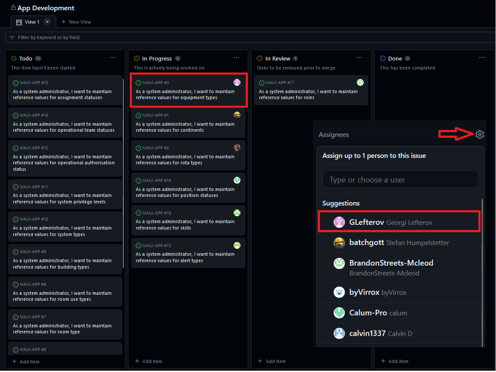
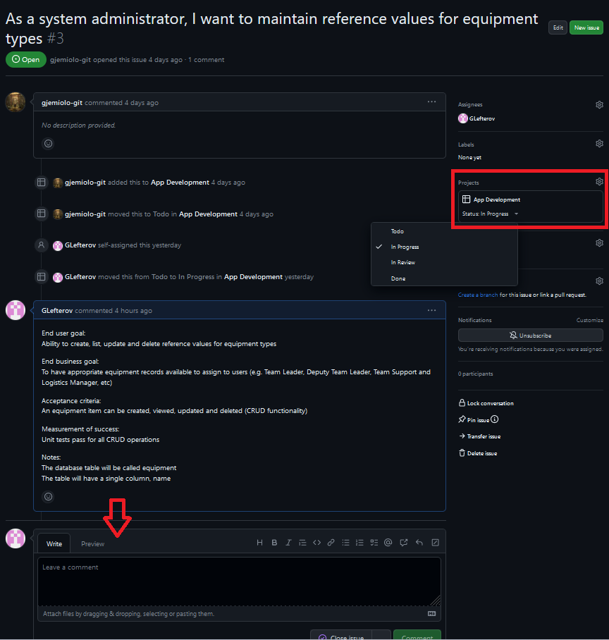
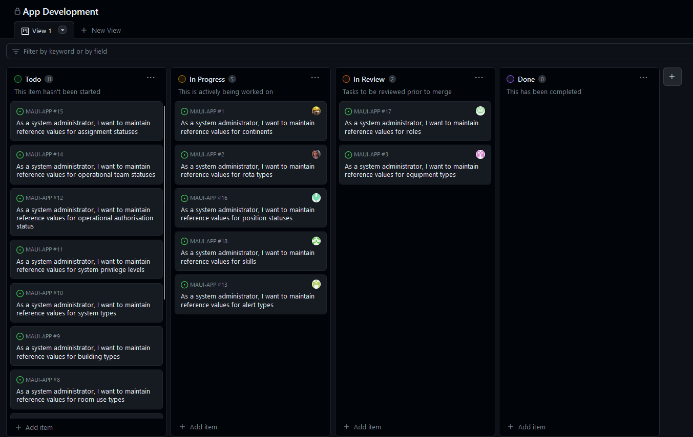
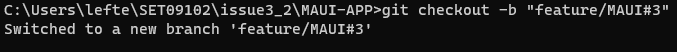
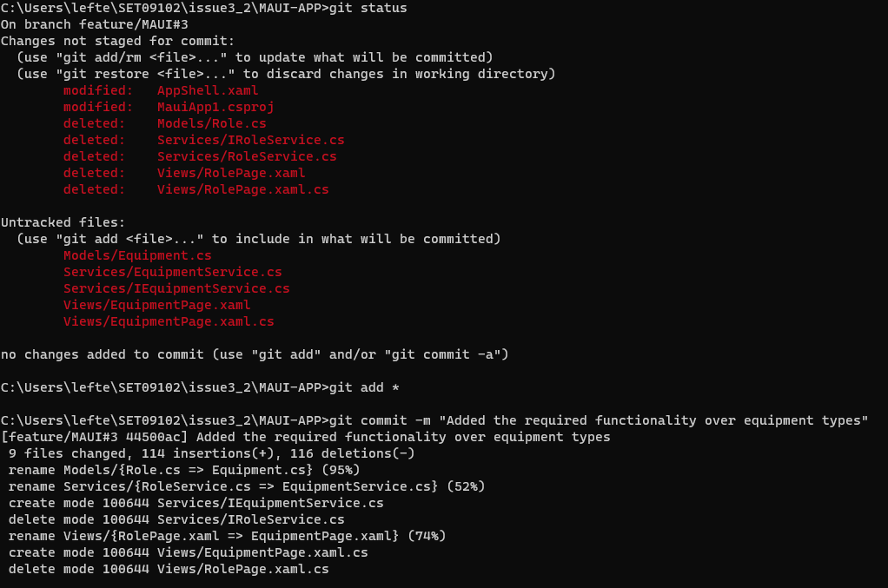
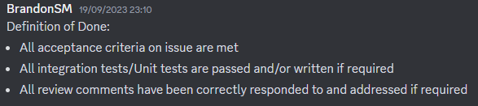
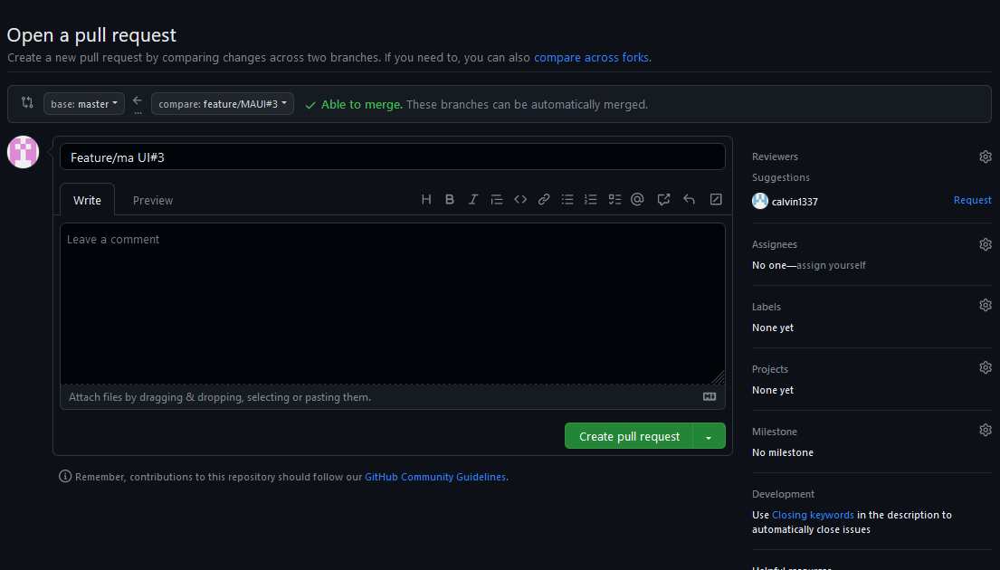

# Workflow

This document provides a meticulous step-by-step breakdown of our team's operational procedure on GitHub, accentuated with images for an enhanced comprehension.

Table of Contents

1. [Introduction to .NET MAUI](#MAUI-intro)
2. [Task Workflow](#task-workflow)<br>
   2.1 [Accepting a Task from the Project Backlog](#accepting-task)<br>
   2.2 [Updating Task Information](#updating-task)<br>
   2.3 [Task Board Updates](#task-board)<br>
   2.4 [Feature Branch Creation and Development](#feature-branch)<br>
   2.5 [Committing with Descriptive Comments](#committing-changes)<br>
   2.6 [Verification Against the Definition of Done](#verification)<br>
   2.7 [Initiating a Pull Request](#pull-request)<br>
3. [Reflection](#critical-reflection)

## 1. Introduction to .NET MAUI <a id="MAUI-intro">

Before diving into the workflow, it was vital to familiarize myself with the core tools I'll be using during this Module. As .NET MAUI is our chosen framework, I familiarized myself with the technology following the links in the practical session: 

Steps to Get Started:
   Begin with Basics:
       Understand C# and .NET MAUI by constructing a sample app. <br>
       Tutorial:  [Getting started](https://learn.microsoft.com/en-us/dotnet/maui/tutorials/notes-app/)<br>

   Level Up:
       Enhance the application by integrating a local SQLite database.<br>
       Tutorial: [Adding a databse](https://learn.microsoft.com/en-us/dotnet/maui/data-cloud/database-sqlite)<br>


## 2. Task workflow <a id="workflow-steps"></a>
Task workflows are a powerful tool that can help us to improve our software development process. As such, we must be able to use
them properly and comfortably while following the conventions. 

### 2.1 Accepting a Task from the Project Backlog <a id="accepting-task"></a>
Tasks are listed in the backlog based on their priority and the expertise required. Usually, during a sprint planning sessions it is decided who takes which tasks. We can then easily self-assign ourselves the task.
<figure>

<figcaption align="center"><b>Fig.1 - Issues View </b></figcaption>
</figure>

This image illustrates the issues view and also how to assign a task to somebody by following the marked steps.

### 2.2 Updating Task Information <a id="updating-task"></a>

Upon accepting a task, it's essential to modify its status. This keeps the team in the loop, reducing the risk of multiple members working on the same task. Additionally, updating the estimated time of completion helps in efficient project management. The updated status can include "In Progress", "On Hold", or any other state that's relevant to the project's lifecycle.

<figure>

<figcaption align="center"><b>Fig.2 - Update issue </b></figcaption>
</figure>

This image shows how to update the updated issue statuses and how to leave a comment including useful information e.g. findings after research/investigating that might be useful later.

### 2.3 Task Board Updates <a id="task-board"></a>

Using a task board is pivotal for visual tracking. By moving tasks across columns like "To-Do", "In Progress", and "Completed", it provides an immediate snapshot of project progress. This also aids in workload management and ensures no tasks are left unattended.

<figure>

<figcaption align="center"><b>Fig.3 - Task Board Updates </b></figcaption>
</figure>

This image contains the board including all the issues split amongst all the existing in our repository statuses.

### 2.4 Feature Branch Creation and Development <a id="feature-branch"></a>

Incorporating new features directly into the main branch can lead to instability. Hence, for every task or feature, a separate branch is created. This isolation allows for safe experimentation and development without jeopardizing the integrity of the primary code.
In my case I used the following command: <br>&nbsp;&nbsp;&nbsp;&nbsp;&nbsp;&nbsp;&nbsp;&nbsp;&nbsp;&nbsp;&nbsp;`git checkout -b "feature/MAUI#3"`
<br>Specifying "-b" causes a new branch to be created as if git-branch was called and then checked out.
<figure>

<figcaption align="center"><b>Fig.4 - Checking out into a new branch </b></figcaption>
</figure>

### 2.5 Committing with Descriptive Comments <a id="committing-changes"></a>

To maintain clarity and context, every code commit is paired with a comprehensive message. This not only assists team members in understanding the rationale behind the changes but also maintains a transparent history of the project's evolution.
The commands I've used to commit were: 
````bash
git status  
git add *
git commit -m "Commit message"
git push --set-upstream origin feature/MAUI#3
````
<figure>

<figcaption align="center"><b>Fig.5 - Commiting with descriptive comments </b></figcaption>
</figure>

### 2.6 Verification Against the Definition of Done <a id="verification"></a>
The 'Definition of Done' serves as a checklist to ensure a task meets all criteria before being deemed complete. This includes aspects like code quality, testing, and documentation. This final validation ensures that the task aligns with the project's requirements and maintains a consistent standard.
<figure>

<figcaption align="center"><b>Fig.6 - Definition of Done used within our team </b></figcaption>
</figure>

As we yet haven't implemented any unit tests, all the testing had to be done manually by me on my local environment. However, everything seems working, so I'm ready to push to the remote.

### 2.7 Initiating a Pull Request <a id="pull-request"></a>

Once a task has been validated and is ready for integration, a pull request is initiated. This process allows team members to review the new code, suggest modifications if necessary, and ensures that the merging into the main codebase is smooth and error-free.
<figure>

<figcaption align="center"><b>Fig.7 - Initiating a Pull Request </b></figcaption>
</figure>


## 3. Reflection

Embarking on this project, we were keenly aware of the intrinsic complexities of software development. Our early discussions prioritized the establishment of good practices and protocols, recognizing their importance in ensuring efficiency and maintaining the integrity of our work.

Our adoption of a clear workflow, grounded in the principles of Agile methodologies, was pivotal. Regular stand-up meetings kept the team aligned, ensuring that everyone was abreast of the project's status. This not only aided in task distribution but also in identifying potential bottlenecks early on. Some of my propositions to the team during the meeting were implemented in the workflow.md document to our project. Some of my propositions were the 24-hour maximum time to do a code review, before a different team member could finish the review and merge the pull request. This way our timeboxes are met and our commits to the project won't be postponed for a later sprint review.

[Workflow](https://github.com/Software-Engineering-Red/MAUI-APP/blob/master/Documentation/workflow.md)

#### Introduction to workflow
In the pursuit of optimizing our software development process, our team adopted a workflow deeply rooted in Agile-Scrum methodology. This reflection aims to dissect the rationale behind our choices, acknowledging both the strengths and the areas where our approach might not align perfectly with every project scenario.
#### Why Agile-Scrum?
Agile-Scrum was chosen primarily for its flexibility and emphasis on continuous delivery and improvement. This approach, supported by a wealth of academic literature, promotes adaptability—a crucial attribute in today's rapidly changing software development landscape. The iterative nature of Agile allows for regular feedback and course corrections, ensuring that the end product truly aligns with user needs.
Tools and Techniques
We integrated a variety of tools and techniques to support this methodology:

- IDE with Code Analysis Tools and VCS: Streamlining coding and version control to enhance efficiency and reduce errors.
- CI/CD Pipeline: Automating deployment processes to minimize manual intervention and accelerate release cycles.
- TDD and Code Reviews: Ensuring code quality and maintainability, a practice bolstered by numerous studies highlighting its effectiveness in reducing bugs and fostering cleaner code.
  
#### Team Structure and Communication
Our cross-functional team structure fostered a collaborative environment, essential for Agile's success. Regular stand-ups, sprint planning, and retrospectives were instrumental in maintaining open communication channels. However, we observed that the frequency of meetings, while beneficial for alignment, occasionally impacted deep work phases, suggesting a need for a more balanced approach.
Challenges and Adaptations
Despite the numerous benefits, our workflow wasn't without challenges:
- Scalability: Agile-Scrum can be less effective for larger, more complex projects. In such cases, we found blending Agile with elements of other methodologies, like Waterfall, helped maintain structure without sacrificing agility.
- Learning Curve: New team members initially struggled with the Agile framework and toolset. We mitigated this through mentorship programs and regular training sessions.
  
####Reflection on Continuous Improvement
Reflecting on the effectiveness of our approach, it's clear that while our workflow aligns well with Agile's principles, it requires continuous evaluation and adaptation. The software development landscape is dynamic, and what works today may not be as effective tomorrow. Regular retrospectives were not just a means to refine our current projects but also an opportunity to evolve our overall process.


However, no amount of preparation can completely shield a team from challenges. Merge conflicts became an unexpected tutorial in the nuances of collaborative coding. These experiences underscored the importance of clear communication.
