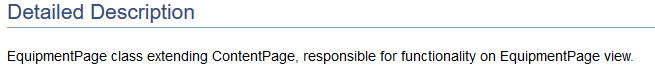
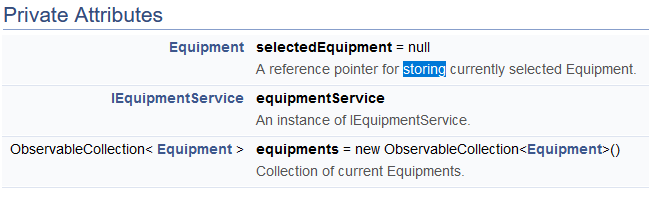
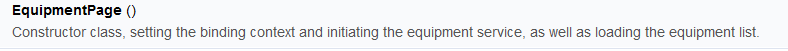
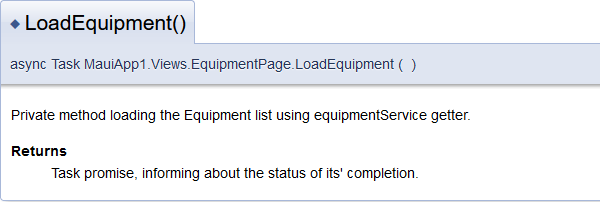
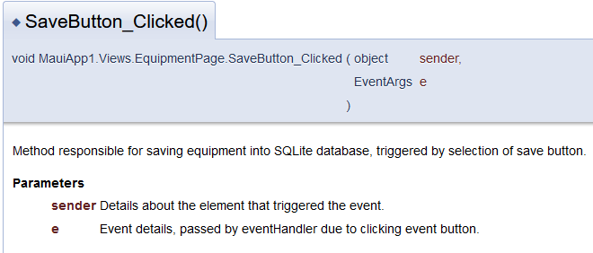

# Documentation

1. [Six Rules of Clean Code](#clean-code)<br>
   1.1 [Use Meaningful Names](#mean-names)<br>
   1.2 [Functions Should Do One Thing](#func-one)<br>
   1.3 [Keep Function Arguments Minimal](#kfam)<br>
   1.4 [Avoid Side Effects](#ase)<br>
   1.5 [Keep it Simple, Stupid](#KISS-changes)<br>
   1.6 [Verification Against the Definition of Done](#verification)<br>
2. [Doxygen Comments](#doxygen-comms)<br>
3. [Examples for usage of clean code](#usage-clean-code)

## 1. First Part: Six Rules of Clean Code <a id=clean-code>

### 1.1 Use Meaningful Names: <a id=mean-names>
**Summary**: Variables, methods, classes, and other entities should have descriptive names that immediately convey their purpose. <br> **Example from Code**: The ```IEquipmentService``` interface and its methods like ```GetEquipmentList```, ```AddEquipment```, etc.<br>**Implementation**: ```IEquipmentService``` immediately suggests that it's an interface dealing with equipment-related operations. Similarly, ```GetEquipmentList``` clearly conveys that it's a method to fetch a list of equipment.

### 1.2 Functions Should Do One Thing: <a id=func-one>
**Summary**: A function/method should have one, and only one, reason to change, meaning it should perform one specific task.<br>**Example from Code** The ```SetUpDb``` method in ```EquipmentService``` class.<br>**Implementation**: The ```SetUpDb``` method's sole responsibility is to set up a connection to the SQLite database and create the ```Equipment``` table if it doesn't exist.

### 1.3 Keep Function Arguments Minimal:<a id=kfam>
**Summary**: Ideally, functions should have a small number of arguments. Fewer arguments make the function easier to understand and use.<br>**Example from Code**: All methods within ```IEquipmentService``` (e.g., ```DeleteEquipment(Equipment equipment)```).<br>**Implementation**: Most of the methods in ```IEquipmentService``` take in only the necessary arguments, often just one (like the Equipment object), to accomplish their tasks.

### 1.4 Avoid Side Effects:<a id=ase>
**Summary**: A function should not produce any unexpected changes in the system state or alter any global variables without it being a clear part of its spec.<br>**Example from Code**: ```LoadEquipment``` method in ```EquipmentPage```.<br>**Implementation**: ```LoadEquipment``` method only loads the equipment list and assigns it to ```equipments```. It doesn’t modify any global state or produce side effects elsewhere.

### 1.5 Keep it Simple, Stupid (KISS):<a id=KISS>
**Summary**:The KISS principle emphasizes simplicity. Avoid complex solutions when a simpler one will do. This makes the code easier to read, understand, and maintain.<br>**Example from Code**:  The ```SetUpDb``` method in ```EquipmentService```. Rather than having multiple methods or complex logic to handle database setup, it's condensed into a single method that ensures a connection and creates a table if it doesn’t exist.<br>**Implementation**:  By just calling ```SetUpDb```, other methods ensure the database is ready for operations. This simplicity reduces potential points of failure and keeps the codebase neat.
### 1.6 DRY (Don’t Repeat Yourself): <a id=accepting-task>
**Summary**: Code duplication should be avoided. If you find yourself copying and pasting the same logic multiple times, consider refactoring.<br>**Example from Code**: The use of ```SetUpDb``` method in multiple functions of the ```EquipmentService``` class.<br>**Implementation**: Instead of repeating the database setup logic in every method, the ```SetUpDb``` method is used to handle that task, thus adhering to the DRY principle.

## 2. Doxygen Comments <a id=doxygen-comms>
```csharp
   /* <summary>
        EquipmentPage class extending ContentPage, responsible for functionality on EquipmentPage view.
    </summary> */
```
 <br>
Fig. 1 HTML output for the EquipmentPage class <br>
**Commentary:**
* The comment gives a concise introduction to the EquipmentPage class. It identifies the parent class (ContentPage) and clarifies its primary responsibility. This clarity can speed up the process for developers trying to familiarize themselves with the codebase.
* Good Practice: Explicitly stating the class's primary responsibility allows developers to understand its overarching function without diving into its methods and properties.
```csharp
/* <summary>
        A reference pointer for storing currently selected Equipment.
 </summary> */

```
 <br>
Fig. 2 HTML all the private attributes(the next comments)<br>
**Commentary:**
* This comment clarifies the role of the selectedEquipment variable. By mentioning it's a "reference pointer," the comment indicates that this variable might be updated or pointed to different instances of Equipment throughout the class's lifecycle.
* Good Practice: Explaining the intended purpose of a variable can help other developers make informed decisions about its usage and potential side effects.
```csharp
/*! <summary>
        An instance of IEquipmentService
     </summary> */
```

**Commentary:**
* The comment is straightforward and clarifies that equipmentService is an instance of the IEquipmentService interface. This is crucial for developers who might be looking for the origins of the methods or properties accessed through this variable.
* Good Practice: Specifying the type or interface that a class variable implements provides a quick reference and can save a developer from searching through the codebase.
```csharp
/*! <summary>
        Collection of current Equipments.
    <summary> */
```

**Commentary:**
* This comment indicates that equipments is actively used or modified as the equipment data changes. Words like "current" give insights into the dynamic nature of this collection.
* Good Practice: Indicating the mutable nature of data structures helps developers anticipate state changes and potential synchronization requirements.
```csharp
/*! <summary>
        Constructor class, setting the binding context and initiating the equipment service, as well as loading the equipment list.
    <summary> */
```
 <br>
Fig. 3 HTML output for the custom constructor<br>
**Commentary:**
* Describing the core actions taken by the constructor ensures that developers understand the initial state of an instance and its dependencies. This can be essential for debugging or optimizing the initialization process.
* Good Practice: Detailed documentation of constructors aids in understanding initialization sequences and the order of operations, particularly in complex classes.
```csharp
/*! <summary>
        Private method loading the Equipment list using equipmentService getter.
    <summary> 
    <returns>Task promise, informing about the status of its' completion.<returns> */
```
 <br>
Fig. 4 HTML output for the LoadEquipment function<br>
**Commentary:**
* The comment helps developers understand the asynchronous nature of the method and its dependency on equipmentService.
* Good Practice: Documenting asynchronous methods with their return types and expected behavior is crucial. It ensures that developers using these methods handle them correctly, especially when dealing with tasks, promises, or other asynchronous patterns.

```csharp
/*! <summary>
         ... 
    </summary> 
    <param name="sender">...</param>
    <param name="e">...</param> */
```
 <br>
Fig. 5 HTML output for the event handlers<br>
**Commentary:**
* These comments detail event handler methods. They effectively convey the intent behind each method and provide insights into the expected parameters.
* Good Practice: Documenting event handlers with parameter details assists developers in understanding the context in which the events are triggered and how to potentially add, modify, or remove event sources.

These comments provide concise yet comprehensive descriptions, aiding in understanding the class structure and its components. They not only describe "what" each component is but often touch on the "why" or the purpose behind them, leading to more intuitive and maintainable code.

## 3. Examples for usage of clean code <a id=usage-clean-code>

After further conversations with the team, we concluded that some functions whose names follow the conventions and are clean can be left without comments, as the need for one is eliminated by following good practices and naming conventions. There are 3 examples:
```csharp
ObservableCollection&lt;Equipment&gt; equipments = new ObservableCollection&lt;Equipment&gt;();
```
**Explanation:** The variable equipments clearly indicates that it holds a collection of equipment items. There's no need for a comment like "This variable holds all the equipment" because the name already provides this information.

```csharp
private async Task LoadEquipment()
```

**Explanation:** The method name ```LoadEquipment``` is self-explanatory. It suggests that the method's responsibility is to load or retrieve equipment. Therefore, there's no immediate need for a comment like "This method loads the equipment data" because the name itself is already quite informative.

```csharp
private void SaveButton_Clicked(object sender, EventArgs e)
private void DeleteButton_Clicked(object sender, EventArgs e)
private void ltv_equipment_ItemSelected(object sender, SelectedItemChangedEventArgs e)
```

**Explanation:** The method names for these event handlers clearly indicate the associated UI component and the type of event they handle. For instance, ```SaveButton_Clicked``` clearly suggests this method handles the click event of a button meant for saving. Likewise, ```ltv_equipment_ItemSelected``` tells us it's related to an item being selected in a list view named ```ltv_equipment```. This eliminates the need for comments like "Triggered when the save button is clicked" or "Handles when an item in the equipment list is selected."

**Summary:** In these instances, following the principles of clean code, particularly in terms of clear naming conventions, has removed the necessity for explicit comments. When the code is written descriptively and intuitively, it reduces the reliance on comments for understanding, making the codebase more maintainable and straightforward. However, just following the good practices and leaving the code without any comments is not a good option either. We need to find the perfect symbiosis between both situations - having too much or not enough comments.
